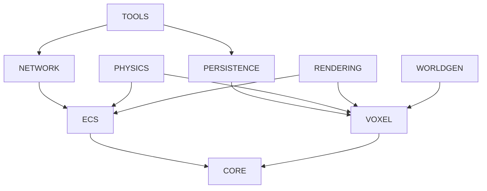

# Core Engine

Camada fundamental da engine que fornece infraestrutura base para todos os outros sistemas.

## Purpose

O Core Engine é responsável por:
- Gerenciamento do loop principal de atualização
- Sistema de eventos para comunicação entre camadas
- Gerenciamento de recursos e assets
- Configuração e inicialização da engine
- Utilitários matemáticos e estruturas de dados comuns

## Arquitetura

```
┌─────────────────────────────────────────────────────────────┐
│                         TOOLS/EDITOR                         │
├─────────────────────────────────────────────────────────────┤
│         NETWORKING        │         PERSISTENCE             │
├─────────────────────────────────────────────────────────────┤
│    PHYSICS    │   RENDERING   │   WORLD GENERATION          │
├─────────────────────────────────────────────────────────────┤
│                     ENTITY SYSTEM (ECS)                      │
├─────────────────────────────────────────────────────────────┤
│                       VOXEL WORLD                            │
├─────────────────────────────────────────────────────────────┤
│                       CORE ENGINE                            │
└─────────────────────────────────────────────────────────────┘
```

---

## Requirements

### Requirement: Engine Initialization

The system SHALL fornecer um ponto de entrada claro para inicialização da engine que configure todos os subsistemas na ordem correta de dependência.

```typescript
interface IEngineConfig {
  canvas: HTMLCanvasElement;
  renderer: 'webgl2' | 'webgpu';
  network?: {
    serverUrl: string;
    protocol: 'websocket' | 'webtransport';
  };
  world?: {
    chunkSize: [number, number, number];
    viewDistance: number;
  };
  debug?: boolean;
}

interface IMotorVoxel {
  init(config: IEngineConfig): Promise<void>;
  start(): void;
  stop(): void;
  destroy(): void;
  
  // Subsystems
  readonly world: IVoxelWorld;
  readonly renderer: IRenderer;
  readonly physics: IPhysicsWorld;
  readonly network: INetworkClient;
  readonly entities: IEntityManager;
  readonly events: IEventBus;
}
```

#### Scenario: Successful initialization with WebGL2
- **WHEN** engine is initialized with valid canvas and WebGL2 config
- **THEN** all subsystems SHALL be created in dependency order
- **AND** renderer SHALL be initialized with WebGL2 context
- **AND** init promise SHALL resolve successfully

#### Scenario: Fallback when WebGPU unavailable
- **WHEN** engine is configured for WebGPU but browser doesn't support it
- **THEN** engine SHALL fallback to WebGL2 automatically
- **AND** a warning event SHALL be emitted

#### Scenario: Initialization failure
- **WHEN** canvas is invalid or WebGL2 is not supported
- **THEN** init promise SHALL reject with descriptive error
- **AND** no partial initialization SHALL remain

---

### Requirement: Game Loop Management

The system SHALL implementar um loop de jogo com timestep fixo para física e timestep variável para renderização.

```typescript
interface IGameLoop {
  readonly isRunning: boolean;
  readonly currentTime: number;
  readonly deltaTime: number;
  readonly fixedDeltaTime: number;
  readonly fps: number;
  
  start(): void;
  stop(): void;
  
  // Callbacks de update são registrados via eventos
}

// Constantes recomendadas
const FIXED_TIMESTEP = 1000 / 60;  // 16.67ms para 60 ticks/s
const MAX_FRAME_TIME = 250;         // Evitar spiral of death
```

#### Scenario: Fixed timestep physics update
- **WHEN** game loop is running
- **THEN** physics update SHALL be called with fixed 16.67ms timestep
- **AND** multiple physics steps MAY occur per frame if needed
- **AND** accumulated time SHALL not exceed MAX_FRAME_TIME

#### Scenario: Variable timestep rendering
- **WHEN** game loop is running
- **THEN** render SHALL be called once per frame with actual delta time
- **AND** interpolation factor SHALL be provided for smooth rendering

#### Scenario: Frame timing
- **WHEN** measuring performance
- **THEN** FPS counter SHALL be accurately calculated
- **AND** frame time histogram SHALL be available for profiling

---

### Requirement: Event System

The system SHALL fornecer um barramento de eventos tipado para comunicação desacoplada entre subsistemas.

```typescript
interface IEventBus {
  on<T extends keyof EngineEvents>(
    event: T, 
    handler: (data: EngineEvents[T]) => void
  ): () => void;  // Returns unsubscribe function
  
  once<T extends keyof EngineEvents>(
    event: T,
    handler: (data: EngineEvents[T]) => void
  ): () => void;
  
  emit<T extends keyof EngineEvents>(
    event: T,
    data: EngineEvents[T]
  ): void;
  
  off<T extends keyof EngineEvents>(
    event: T,
    handler?: (data: EngineEvents[T]) => void
  ): void;
}

// Mapa de eventos tipados
interface EngineEvents {
  // Lifecycle
  'engine:init': void;
  'engine:start': void;
  'engine:stop': void;
  'engine:destroy': void;
  
  // Loop
  'loop:update': { deltaTime: number; time: number };
  'loop:fixedUpdate': { fixedDeltaTime: number; time: number };
  'loop:render': { deltaTime: number; interpolation: number };
  
  // World
  'chunk:loaded': { x: number; y: number; z: number };
  'chunk:unloaded': { x: number; y: number; z: number };
  'block:changed': { x: number; y: number; z: number; oldType: BlockId; newType: BlockId };
  
  // Entities
  'entity:spawned': { entityId: EntityId; components: ComponentMask };
  'entity:destroyed': { entityId: EntityId };
  
  // Network
  'network:connected': void;
  'network:disconnected': { reason: string };
  'network:error': { error: Error };
}
```

#### Scenario: Event subscription
- **WHEN** a handler subscribes to an event
- **THEN** handler SHALL be called when event is emitted
- **AND** unsubscribe function SHALL properly remove handler

#### Scenario: Typed event data
- **WHEN** event is emitted
- **THEN** data SHALL match the expected type for that event
- **AND** TypeScript SHALL provide compile-time type checking

#### Scenario: Event ordering
- **WHEN** multiple handlers subscribe to same event
- **THEN** handlers SHALL be called in subscription order

---

### Requirement: Resource Management

The system SHALL gerenciar carregamento e cache de recursos (texturas, shaders, áudio).

```typescript
interface IResourceManager {
  load<T extends ResourceType>(
    type: T,
    url: string,
    options?: ResourceOptions[T]
  ): Promise<ResourceResult[T]>;
  
  get<T extends ResourceType>(
    type: T,
    url: string
  ): ResourceResult[T] | undefined;
  
  preload(manifest: ResourceManifest): Promise<void>;
  
  unload(url: string): void;
  clear(): void;
  
  readonly loadingProgress: number;  // 0-1
}

type ResourceType = 'texture' | 'shader' | 'audio' | 'json' | 'binary';

interface ResourceManifest {
  textures?: string[];
  shaders?: Array<{ vertex: string; fragment: string; name: string }>;
  audio?: string[];
  json?: string[];
}
```

#### Scenario: Texture loading
- **WHEN** texture is requested
- **THEN** system SHALL load and decode image
- **AND** create GPU texture resource
- **AND** cache for future requests

#### Scenario: Shader compilation
- **WHEN** shader is loaded
- **THEN** system SHALL compile vertex and fragment shaders
- **AND** link program
- **AND** cache uniform locations

#### Scenario: Preload manifest
- **WHEN** preload is called with manifest
- **THEN** all resources SHALL be loaded in parallel
- **AND** progress SHALL be reported via loadingProgress

---

### Requirement: Configuration System

The system SHALL fornecer configuração flexível com valores padrão sensatos.

```typescript
interface IConfigManager {
  get<T extends keyof EngineConfig>(key: T): EngineConfig[T];
  set<T extends keyof EngineConfig>(key: T, value: EngineConfig[T]): void;
  reset(): void;
  
  readonly all: Readonly<EngineConfig>;
}

interface EngineConfig {
  // Rendering
  renderDistance: number;          // Chunks, default: 8
  fov: number;                     // Degrees, default: 70
  targetFps: number;               // Default: 60
  enableVSync: boolean;            // Default: true
  
  // World
  chunkSizeX: number;              // Default: 16
  chunkSizeY: number;              // Default: 256
  chunkSizeZ: number;              // Default: 16
  
  // Physics
  gravity: number;                 // Default: -20
  maxFallSpeed: number;            // Default: -50
  
  // Network
  serverTickRate: number;          // Default: 20
  interpolationDelay: number;      // Ms, default: 100
  
  // Debug
  showDebugInfo: boolean;          // Default: false
  showChunkBorders: boolean;       // Default: false
  wireframeMode: boolean;          // Default: false
}
```

#### Scenario: Default values
- **WHEN** engine is initialized without explicit config
- **THEN** sensible defaults SHALL be applied

#### Scenario: Runtime configuration change
- **WHEN** configuration value is changed at runtime
- **THEN** affected systems SHALL update accordingly
- **AND** change event SHALL be emitted

---

### Requirement: Math Utilities

The system SHALL fornecer utilitários matemáticos otimizados para operações 3D comuns.

```typescript
// Tipos fundamentais
type Vec3 = Float32Array;  // [x, y, z]
type Vec2 = Float32Array;  // [x, y]
type Mat4 = Float32Array;  // 4x4 matrix, column-major
type Quat = Float32Array;  // [x, y, z, w]

// Coordenadas de chunk
interface ChunkCoord {
  readonly cx: number;
  readonly cy: number;
  readonly cz: number;
}

// Coordenadas locais dentro de chunk
interface LocalCoord {
  readonly lx: number;  // 0 to CHUNK_SIZE_X - 1
  readonly ly: number;  // 0 to CHUNK_SIZE_Y - 1
  readonly lz: number;  // 0 to CHUNK_SIZE_Z - 1
}

// Utilitários
namespace VoxelMath {
  function worldToChunk(worldX: number, worldZ: number): ChunkCoord;
  function worldToLocal(worldX: number, worldY: number, worldZ: number): LocalCoord;
  function chunkToWorld(chunk: ChunkCoord): Vec3;
  function localToIndex(local: LocalCoord, sizeX: number, sizeY: number): number;
  function indexToLocal(index: number, sizeX: number, sizeY: number): LocalCoord;
}
```

#### Scenario: Coordinate conversion
- **WHEN** converting world coordinates to chunk coordinates
- **THEN** result SHALL correctly identify containing chunk
- **AND** handle negative coordinates properly

#### Scenario: Index calculation
- **WHEN** converting local coordinates to array index
- **THEN** index SHALL be consistent with flat array storage
- **AND** be reversible back to coordinates

---

## Design Decisions

### WebGL2 vs WebGPU

| Aspecto | WebGL2 | WebGPU |
|---------|--------|--------|
| Compatibilidade | 95%+ browsers | ~40% browsers (2024) |
| Performance | Boa | Excelente |
| API | OpenGL ES 3.0-like | Moderno, Vulkan-like |
| Compute Shaders | Não | Sim |
| Recomendação | **Padrão inicial** | Opt-in para hardware moderno |

**Decisão**: Implementar primeiro com WebGL2, com abstração que permita backend WebGPU futuro.

### Estrutura de Pastas

```
src/
├── core/
│   ├── Engine.ts           # Classe principal
│   ├── GameLoop.ts         # Loop de jogo
│   ├── EventBus.ts         # Sistema de eventos
│   ├── ResourceManager.ts  # Gerenciador de recursos
│   ├── Config.ts           # Configuração
│   └── math/
│       ├── vectors.ts      # Operações de vetor
│       ├── matrix.ts       # Operações de matriz
│       └── coords.ts       # Conversões de coordenadas
├── voxel/
├── rendering/
├── physics/
├── network/
├── entities/
└── tools/
```

### Dependências entre Camadas


